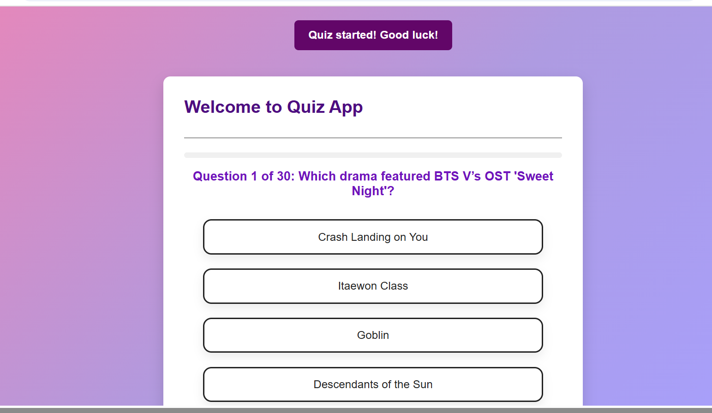

# 📝 QUIZ-APP

A fun interactive quiz app built with **HTML** , **CSS** and **JAVASCRIPT**.Users can select a category,answer multiple-chioce question and see their score at the end.

## 🚀 Features
 ✅Selection between categories[**Generalknowledge** and **Koreanentertainment**]

 ✅Shuffled answer option for each question.

 ✅Progress bar to track quiz completion

 ✅ Responsive and mobile-friendly design  
 
 ✅ Notification system for category selection and score display

#### 📸 Screenshot

## 💻 Tech Stack 
- **HTML5** – Structure of the app.

- **CSS3** – Styling, gradients, buttons, animations.

- **JavaScript** (ES6 Modules) – Quiz logic, category selection, progress bar, and notifications.

## 💡 Usage 🖊️ / Setup
1. Clone or download the repository.

2. Open index.html in your browser.

3. Select a category to start the quiz.

4. Answer the questions by clicking on the options.

5. View your score at the end and choose to Play Again or Change Category.

## 📦 Future Enhancements
* 🔐 Add authentication (login/signup)
* ⏳Timer for each question.
* 🔊Sound effects and animations

## 📬 Contact
For questions or feedback, reach out  via email at [joynelsoninfo@gmail.com]

## 🧑‍💻 Author
GitHub: [https://github.com/joystackinfo]